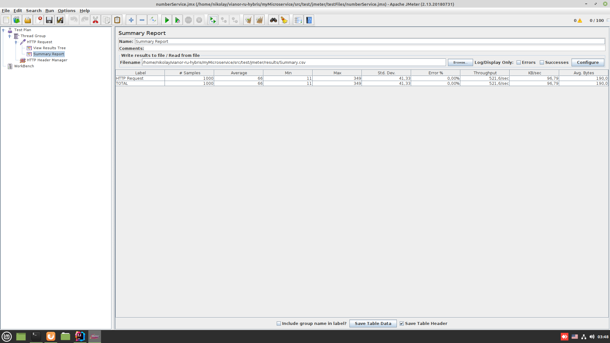

**Задача**
1. Реализовать REST микросервис, сохраняющий в таблицу БД число из запроса.
2. Необходимо с помощью приложения jmeter сделать замерывыполнения очень большого числа запросов (1000, 100к, 1млн).
3. Java/Kotlin, spring boot, Docker, Jmeter, любая БД.

Результаты тестов (1000 запросов)

Результаты тестов (100к запросов)

Результаты тестов (1млн запросов)
